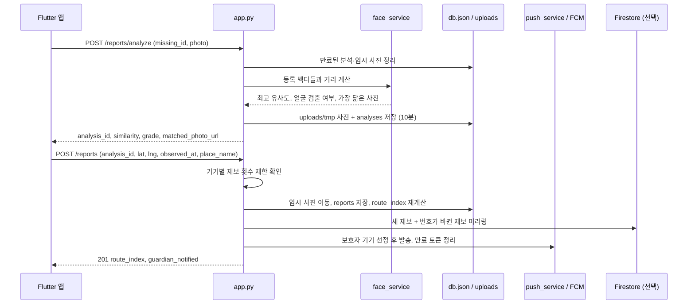
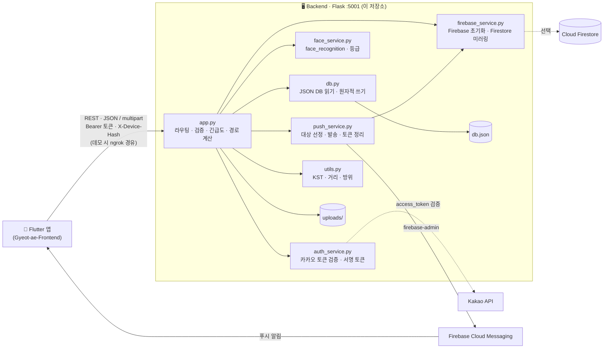

<div align="center">

# 곁愛 · 곁애 (Gyeot-ae) — Backend

**시민의 목격 사진 한 장을 AI가 검증하고, 검증된 제보를 시간순으로 이어<br/>실종 아동·어르신의 이동 경로를 복원하는 조기 발견 서비스의 API 서버**

"곁에 있다 + 사랑" — 지나가던 시민의 눈이 모여 실종자의 골든타임을 지킵니다.

🖥️ **Backend · Flask API 서버 (현재 저장소)** · 📱 [Frontend · Flutter 앱](https://github.com/Starton2026/Gyeot-ae-Frontend)

</div>

---

## 1. 서비스 소개

| | |
|---|---|
| **서비스명** | 곁애 (Gyeot-ae) |
| **한 줄 소개** | 시민 제보 → AI 얼굴 유사도 분석 → **시간순 이동 경로 복원** → 보호자에게 즉시 알림 |
| **해결하려는 문제** | 실종 경보는 시민에게 **전달만 되고 돌아오지 않는다.** 목격해도 알릴 창구가 마땅치 않고, 들어온 제보도 진위와 순서를 가리기 어렵다 |
| **핵심 가치** | 시민의 목격이 **보호자에게 되돌아오는 양방향 구조**. 흩어진 제보를 AI가 거르고, 하나의 동선으로 이어 "지금 어디쯤 있을지"를 보여준다 |

```
보호자 등록 → 주변 시민 알림 → 시민 제보(사진) → AI 유사도 분석
→ 검증된 제보를 시간순 연결 → 이동 경로 복원 → 보호자 확인 → 발견
```

이 저장소는 곁애의 **API 서버**입니다. **AI 얼굴 대조, 이동 경로 계산, 긴급도 정렬, 푸시 알림 대상 선정, 인증**을 담당합니다. 사용자 화면은 [Flutter 앱](https://github.com/Starton2026/Gyeot-ae-Frontend)이 맡습니다.

---

## 2. Problem

| 기존 방식의 문제 | 결과 |
|---|---|
| 📢 **일방향 경보** — 재난문자·앰버 경보는 알리고 끝난다 | 시민이 봤더라도 그 목격이 보호자에게 닿는 경로가 없다 |
| 🧾 **제보의 문턱** — 우연히 지나가던 목격자에게 가입·신고 절차는 너무 길다 | 목격한 순간이 지나면 제보는 사라진다 |
| 🧩 **흩어진 제보** — 사진·위치·시간이 따로 논다 | 여러 제보가 모여도 "어느 방향으로 움직였는지" 알 수 없다 |
| ⏱️ **골든타임** — 곁애는 실종 후 **3시간**을 골든타임으로 보고 긴급도를 가장 높게 매긴다 | 늦은 제보, 가짜 제보를 거르는 시간이 곧 수색 시간을 잡아먹는다 |

---

## 3. Solution

곁애는 **"누구나 가입 없이 제보하고, AI가 순서를 매기고, 지도가 잇는다"** 는 흐름으로 문제를 풉니다. 서버는 그 가운데 **판단과 계산**을 맡습니다.

| 단계 | 사용자 경험 | 서버가 하는 일 |
|---|---|---|
| 1. 등록 | 보호자가 사진·인상착의·마지막 위치 입력 | 카카오 토큰 확인 → **모든 사진의 얼굴 벡터 추출** → 얼굴이 하나도 없으면 거부 |
| 2. 알림 | 주변 시민에게 푸시 | 기기 위치·반경·관심 구분·방해 금지 시간으로 **알림 대상 선정** → FCM 발송 |
| 3. 분석 | 시민이 사진을 올리고 결과 확인 | 등록 벡터들과 거리 계산 → **최고 유사도·등급** → 10분짜리 임시 분석으로 보관 |
| 4. 제보 | 시민이 결과를 보고 확정 | 제보 저장 → **경로 번호를 목격 시각 순으로 재계산** → 보호자에게 즉시 푸시 |
| 5. 경로 | 지도에서 시간 슬라이더로 동선 확인 | 타임라인·경로·시간 눈금·제보 간 공백·이동 방향을 한 응답으로 |
| 6. 발견 | 보호자가 발견 완료 | 사건을 **지우지 않고** 완료 처리 → 제보했던 시민들에게 결과 알림 |

---

## 4. 주요 기능

### ① AI 얼굴 유사도 분석 — 분석과 제보의 2단계 분리

| | |
|---|---|
| **해결하는 문제** | 수많은 제보 중 실종자일 가능성이 높은 것을 가려야 한다. 동시에 시민이 결과를 보고 **취소할 수 있어야** 한다 — 이미 저장된 뒤라면 취소는 의미가 없다 |
| **사용 방법** | 앱이 `POST /reports/analyze`로 사진을 보내 결과를 받고, 사용자가 확인하면 `POST /reports`에 `analysis_id`를 넘겨 확정 |
| **기술 구현** | `face_service.py`가 `face_recognition`(dlib)으로 **128차원 얼굴 벡터**를 뽑는다. 실종자 등록 시 사진 **여러 장 각각의 벡터를 모두 저장**하고, 제보 사진과의 거리 중 **최솟값**으로 유사도를 계산해 **가장 닮은 등록 사진**(`matched_photo_url`)도 함께 준다. 분석 결과는 `analyses` 임시 엔티티와 `uploads/tmp/` 사진으로 **10분간** 보관되고, 확정 시에만 정식 경로로 옮겨진다 |

```
유사도(%) = (1 − face_distance) × 100   (소수 1자리 반올림)
```

| 등급 | 구간 | 경로 번호(`route_index`) | 저장 |
|---|---|:---:|:---:|
| `high` | 70% 이상 | O | O |
| `medium` | 40 ~ 70% | O | O |
| `low` | 40% 미만 | X | **O** |
| `no_face` | 얼굴 미검출 | X | **O (에러 아님)** |

### ② 이동 경로 복원

| | |
|---|---|
| **해결하는 문제** | 제보는 도착 순서가 아니라 **목격 순서**로 이어져야 동선이 된다. 사진첩에서 뒤늦게 올린 과거 사진이 경로 끝에 붙으면 방향이 뒤집힌다 |
| **사용 방법** | `GET /missing/{id}/reports?min_similarity=&include_low=&until=` |
| **기술 구현** | `observed_at`(목격 시각)과 `created_at`(전송 시각)을 분리 저장한다. 제보가 확정될 때마다 `recompute_route_indexes`가 **표시 중 + 얼굴 검출 + 유사도 40% 이상 + 좌표 있음** 인 제보를 `observed_at` 순으로 정렬해 **1..n을 전부 다시 매긴다.** 번호가 바뀐 제보는 Firestore에도 함께 갱신한다 |

응답 하나에 앱이 필요한 것을 모두 담습니다.

| 필드 | 정렬 | 용도 |
|---|---|---|
| `reports[]` | **최신순** | 타임라인 카드. 이전 경로 지점 대비 `gap_minutes`, `bearing`(8방위), `distance_from_prev_km` 포함 |
| `path[]` | **시간순** | 폴리라인. 맨 앞에 최초 실종 지점(`origin: true`) |
| `time_range` | — | 시간 슬라이더 양 끝과 제보가 있는 시각의 눈금(`ticks`) |
| `hidden_count` | — | 유사도 필터로 가려진 제보 수 |

### ③ 긴급도 알고리즘 — 사람의 노동이 아니라 계산으로 정렬

| | |
|---|---|
| **해결하는 문제** | 급한 사건이 위에 떠야 한다. "재등록" 같은 **사용자 조작으로 순위를 올리는 방식은 공정하지 않다** |
| **사용 방법** | `GET /missing?sort=urgency&lat=&lng=&radius_km=&q=&category=&status=&cursor=&limit=` |
| **기술 구현** | 요청마다 사건별 점수를 계산한다. 경과 시간도 서버 시각으로 계산해 **사용자가 리셋할 수 없다.** 발견 완료 사건은 **삭제하지 않고** 점수 0으로, 어떤 정렬에서든 **맨 아래**로 내린다. 응답에 `active_count`·`resolved_count`를 따로 줘 "진행 중 N건 · 발견 M건"을 나눠 표시할 수 있게 했다 |

```
긴급도 = 골든타임 × 취약도 × 거리 × 제보공백
```

| 요소 | 가중치 |
|---|---|
| 골든타임 (실종 후 경과) | 3시간 미만 ×3.0 · 12시간 미만 ×2.0 · 48시간 미만 ×1.5 · 이후 ×1.0 |
| 취약도 | 아동·어르신 ×1.5 · 성인(`other`) ×1.0 |
| 거리 (요청자 위치 기준, 하버사인) | 3km 이내 ×2.0 · 10km 이내 ×1.3 · 그 외 ×1.0 |
| 제보 공백 | 마지막 제보(없으면 실종 시각) 후 1시간 경과 ×1.3 |

정렬은 `urgency`(기본) · `recent` · `distance` 중 선택하며, 커서 기반 페이지네이션을 지원합니다.

### ④ 푸시 알림 대상 선정 (FCM)

| | |
|---|---|
| **해결하는 문제** | 알림을 받아야 할 사람 대부분은 **계정이 없는 주변 시민**이다. 너무 넓게 보내면 알림을 끄고, 너무 좁으면 목격자에게 닿지 않는다 |
| **사용 방법** | 앱이 `POST /devices`로 FCM 토큰·기기 해시·좌표·반경·관심 구분·방해 금지 시간을 등록 (로그인 불필요) |
| **기술 구현** | `push_service.py`가 알림 종류마다 다른 규칙으로 대상을 고르고 `firebase-admin` 멀티캐스트(500개씩 끊어서, 안드로이드 high priority)로 발송한다. 발송 결과에서 **만료된 토큰을 감지해 자동으로 지우고**, 발송 장애가 나도 API 응답은 실패시키지 않는다 |

| 알림 | 대상 | 규칙 |
|---|---|---|
| 🆕 새 실종 신고 | 반경 안 기기 | 기기 좌표 기준 반경(기본 5km) · 관심 구분 · 방해 금지 시간(자정 넘는 구간 포함) 반영. **위치를 모르는 기기와 등록자 본인 기기는 제외** |
| 👀 목격 제보 도착 | 사건 보호자의 기기 | **반경·구분·방해 금지 무시** — 내 아이 제보는 새벽 3시에도 알아야 한다. 유사도가 낮거나 얼굴이 없어도 알린다. 보호자가 직접 제보한 경우는 제외 |
| 🎉 발견 완료 | 그 사건에 제보한 사람들 | 회원 ID **또는 기기 해시**로 식별 → 게스트 제보자에게도 결과가 돌아감 |

보낼 때마다 받는 사람별로 **앱 알림함에도 기록**한다(`GET /me/notifications`). 푸시가 실제로 갔는지와 상관없이 남아서, 폰이 꺼져 있었거나 서버에 Firebase 키가 없는 시연 환경에서도 앱을 열면 보인다. 동네 소식은 기기에, 보호자 제보 알림은 **계정에만** 남긴다 — 기기에 남기면 같은 폰으로 다른 계정이 로그인했을 때 남의 사건 소식이 보인다.

### ⑤ 인증과 게스트 식별

| | |
|---|---|
| **해결하는 문제** | 허위 실종 등록은 막아야 하지만, **제보는 로그인 없이** 열려 있어야 한다 |
| **사용 방법** | 로그인: `POST /auth/kakao` → 이후 `Authorization: Bearer <token>`. 게스트: 모든 요청에 `X-Device-Hash` |
| **기술 구현** | 앱이 받은 카카오 `access_token`을 서버가 **카카오 API(`/v2/user/me`)에 직접 물어 검증**하고, 처음 보는 사용자면 그 자리에서 계정을 만든다 (서버에는 카카오 키가 필요 없음). 자체 토큰은 `itsdangerous`로 서명(7일). 로그인할 때 같은 기기의 **게스트 제보를 계정으로 귀속**한다. 게스트 남용은 **사건 1건당 기기 기준 10분 내 3회**로 제한(`429 RATE_LIMITED`), 발견 완료는 **등록한 보호자만**(`403 FORBIDDEN`) |

### ⑥ 보호자 사건 관리 — 사진을 더하면 경로가 다시 그려진다

| | |
|---|---|
| **해결하는 문제** | 실종 뒤에야 떠오르는 인상착의, 나중에 찾은 다른 각도의 사진, 허위·중복 제보. 등록한 순간의 정보만으로는 수색이 끝까지 가지 않는다 |
| **사용 방법** | 상세 응답의 `is_guardian`이 true면 앱이 보호자 메뉴를 연다. 정보 수정 `PATCH /missing/{id}`, 사진 추가 `POST /missing/{id}/photos`, 제보 관리 `PATCH /reports/{id}`, 발견 완료 `POST /missing/{id}/resolve` |
| **기술 구현** | **사진을 더하면 새 얼굴 벡터를 합친 뒤 기존 제보의 유사도를 전부 다시 계산하고 경로 번호를 다시 붙인다.** 뒷모습·옆모습이라 낮게 나왔던 진짜 제보가 경로에 들어올 수 있다(얼굴을 못 찾은 제보는 결과가 같아 건너뜀). 정보 수정은 인상착의·위치·키·몸무게만 받고, **이름·나이·성별·구분·실종 일시는 400으로 막는다** — 경과 시간과 긴급도를 조작할 수 없게. 제보는 **지우지 않고 숨긴다**: 숨긴 제보는 경로와 시민 응답에서 빠지고 보호자에게만 `status=hidden`으로 남아 되돌릴 수 있다. 긴급도 올리기(부스트)는 사용자 조작으로 순위를 올리지 않는다는 원칙에 따라 만들지 않았다 |

---

## 5. 차별점

### 기존 서비스·방식과 무엇이 다른가?

| | 기존 실종 경보 / 제보 게시판 | **곁애** |
|---|---|---|
| 정보 흐름 | 일방향 전달 | **시민 → 보호자로 되돌아오는 양방향** (제보 즉시 푸시, 발견 시 제보자에게 결과 알림) |
| 제보 문턱 | 가입·전화·양식 | **로그인 없이 사진 한 장** |
| 제보 검증 | 사람이 하나하나 확인 | **AI 유사도 등급**으로 우선순위 제시, 최종 판단은 사람 |
| 결과물 | 제보 목록 | **시간순 이동 경로** (`path` + `time_range`) |
| 노출 순서 | 최신순 또는 수동 재등록 | **긴급도 알고리즘** 자동 정렬 |

### AI가 만드는 가치 — "걸러내기"가 아니라 "순서 매기기"

- **40% 미만 제보도 저장합니다.** 옷을 갈아입었거나 뒷모습만 찍힌 진짜 제보가 있고, **고령자는 얼굴 인식 정확도가 구조적으로 낮기** 때문입니다. 임계값은 삭제 기준이 아니라 **표시 등급과 경로 포함 여부**만 정합니다.
- **얼굴 미검출은 에러가 아닙니다.** `face_found: false`로 저장되어 위치와 시간만으로 타임라인에 기여합니다. 반대로 **실종자 등록**은 모든 사진에서 얼굴이 안 잡히면 `400 FACE_NOT_FOUND`로 거부해 **대조 기준 자체는 보장**합니다.
- **여러 장의 등록 사진 중 최고값**을 쓰므로 각도·조명이 다른 목격 사진에도 강하고, 어느 사진과 닮았는지 돌려줘 **사람이 눈으로 검증**할 수 있습니다.
- **외부 AI API가 아닌 서버 로컬 추론**입니다. 실종자·목격자 사진이 제3자 서비스로 나가지 않습니다.

### 서버 설계 원칙

| 원칙 | 적용 |
|---|---|
| **숫자를 부풀리지 않는다** | `notified_devices`·`guardian_notified`는 알림 대상 수가 아니라 **실제 발송 성공 값**. 키가 없으면 0 / false |
| **곁다리가 실패해도 본체는 산다** | Firebase 키가 없거나 Firestore가 장애여도 등록·제보·발견 완료는 성공 |
| **틀린 요청이 흔적을 남기지 않는다** | 필수값을 **사진 저장 전에** 전부 검사, 얼굴 미검출로 거부하면 저장한 사진·썸네일 삭제 |
| **쓰지 않는 개인정보는 받지 않는다** | 보호자 연락처를 수집하지 않음. Firestore 미러링 시 얼굴 벡터 제외 |
| **사건은 지우지 않는다** | 발견 완료도 목록에 남겨, 서비스가 실제로 작동한 기록을 쌓는다 |

---

## 6. 서비스 이용 흐름

```text
[앱] 사용자 입력 (등록 / 사진 제보 / 지도 조회)
   ↓  REST · JSON / multipart · Bearer 토큰 · X-Device-Hash
[Flask app.py] 요청 검증 · 인증 확인 (auth_service → 카카오 API)
   ↓
[face_service] 얼굴 벡터 추출 · 거리 계산 · 등급
[utils]        경과 시간 · 하버사인 거리 · 8방위
   ↓
[db.json · uploads/] 사건 · 제보 · 분석 · 사용자 · 기기 저장, 사진·썸네일
   ↓
[push_service → FCM]         대상 기기에 알림
[firebase_service → Firestore] 사건·제보 미러링 (선택)
   ↓
[앱] 결과 표시 · 지도에 경로 · 푸시 수신
```

### 제보 한 건이 처리되는 과정



---

## 7. 기술 스택

### Backend

| 기술 | 역할 |
|---|---|
| **Python · Flask** | REST API 서버 (포트 5001), 요청 크기 제한 32MB (다중 사진) |
| **flask-cors** | 다른 오리진의 클라이언트 호출 허용 |
| **Pillow** | 업로드 사진의 목록용 썸네일(`{이름}_thumb.jpg`, 폭 400px) 생성 |
| **itsdangerous** | 자체 로그인 토큰 서명·만료 검증 (7일) |
| **requests** | 카카오 사용자 정보 API로 `access_token` 검증 |
| **firebase-admin** | FCM 멀티캐스트 발송, Firestore 기록 |
| **Swagger UI** | `openapi.json`을 `/docs`에서 렌더링 — 모든 엔드포인트를 브라우저에서 호출 가능 |

### AI

| 기술 | 역할 |
|---|---|
| **face_recognition (dlib)** | 서버 로컬에서 얼굴 검출·128차원 벡터 추출·유클리드 거리 계산. 등록 시 여러 장의 벡터를 모두 저장해 최고 유사도 채택 |
| **numpy** | 벡터 배열 거리 계산 |

### Database · 저장소

| 기술 | 역할 |
|---|---|
| **JSON 파일 DB (`db.json`)** | `missing` · `reports` · `analyses` · `users` · `devices` 5개 컬렉션. 임시 파일에 쓰고 `os.replace`로 교체해 **쓰기 도중 실패해도 파일이 깨지지 않게** 함 (해커톤 범위) |
| **로컬 파일 (`uploads/`)** | 등록·제보 사진, 썸네일, 분석 임시 사진(`uploads/tmp/`) |
| **Cloud Firestore (선택)** | `serviceAccountKey.json`이 있으면 `missing/{id}`·`reports/{id}`에 미러링 — 관제 화면 실시간 구독용 |

### 외부 API

| API | 용도 |
|---|---|
| Kakao 사용자 정보 API (`kapi.kakao.com/v2/user/me`) | 앱이 보낸 카카오 토큰의 진위 확인 |
| Firebase Cloud Messaging | 푸시 알림 발송 |
| Cloud Firestore | 사건·제보 실시간 미러링 (선택) |

### 배포 · 실행 환경

| 항목 | 내용 |
|---|---|
| 실행 | 로컬 PC에서 `python app.py` (Flask 개발 서버) |
| 외부 공개 | **ngrok**으로 `https://` 주소 발급 → 앱의 `API_BASE_URL`에 입력 (데모용) |
| 클라우드 배포 | `[확인 필요]` — 현재 코드에 배포 설정 없음 |

---

## 8. 시스템 아키텍처



### 데이터 모델 (`db.json`)

| 컬렉션 | 주요 필드 |
|---|---|
| `missing` | `id`, `guardian_id`, `name`, `age`, `gender`, `category`(child/elderly/other — 앱은 나이로 골라 17세 이하 아동·65세 이상 어르신·그 사이 성인), `description`, `height_cm`, `weight_kg`, `last_lat`, `last_lng`, `last_address`, `missing_at`, `photos[]`, `encoded_photos[]`, `encodings[][]`, `status`(active/resolved), `resolved_at`, `created_at` |
| `reports` | `id`, `missing_id`, `photo`, `lat`, `lng`, `place_name`, **`observed_at`**, `created_at`, `similarity`, `face_found`, `grade`, **`route_index`**, `status`, `device_hash`, `reporter_id` |
| `analyses` | `id`, `missing_id`, `photo`(tmp), `similarity`, `face_found`, `grade`, `matched_photo`, **`expires_at`** |
| `users` | `id`, `kakao_id`, `name`, `profile_image_url`, `created_at` |
| `devices` | `device_hash`, `push_token`, `radius_km`, `categories`, `quiet_hours`, `lat`, `lng`, `user_id`, `updated_at` |

| 설계 포인트 | 이유 |
|---|---|
| `observed_at` ≠ `created_at` | 나중에 올리는 사진 대응. 경로 정렬은 `observed_at` |
| `route_index` 별도 필드 | 제보가 들어올 때마다 번호를 다시 매겨야 함 |
| `encodings[]` 배열 + `encoded_photos[]` | 사진 여러 장의 벡터를 모두 저장하고, 어느 사진의 벡터인지 추적 |
| `analyses` 임시 엔티티 | 분석과 제보의 2단계 분리 (TTL 10분) |
| `device_hash` | 게스트 제보 식별 · 남용 방지 · 발견 알림 대상 |

### API 엔드포인트

| 메서드 | 경로 | 인증 | 설명 |
|---|---|:---:|---|
| `POST` | `/auth/kakao` | — | 카카오 로그인 → 자체 토큰 발급, 게스트 제보 귀속 |
| `GET` | `/auth/me` | 필수 | 내 정보 + 등록 사건 수 · 제보 수 |
| `POST` | `/devices` | — | FCM 토큰 · 반경 · 관심 구분 · 방해 금지 시간 · 기기 좌표 등록 |
| `POST` | `/missing` | 필수 | 실종자 등록 (multipart, 사진 다중) → `201 { id, photos, face_encoding_count, notified_devices }` |
| `GET` | `/missing` | — | 목록: `q` · `category` · `status` · `sort` · `lat`/`lng` · `radius_km` · `cursor` · `limit` |
| `GET` | `/missing/{id}` | — | 상세 (`report_count`, `match_count`, `elapsed_minutes`, 토큰 기준 `is_guardian` 포함) |
| `POST` | `/missing/{id}/resolve` | 보호자 | 발견 완료 + 제보자 알림 → `{ status, resolved_at, notified_reporters }` |
| `PATCH` | `/missing/{id}` | 보호자 | 정보 수정 (인상착의·위치·주소·키·몸무게만) → 바뀐 상세 |
| `POST` | `/missing/{id}/photos` | 보호자 | 사진 추가 + 기존 제보 재분석·경로 번호 재부여 → `{ photos, face_encoding_count, reanalyzed_reports }` |
| `PATCH` | `/reports/{id}` | 보호자 | 제보 숨기기·되돌리기(`status`), 확인함(`confirmed`) |
| `POST` | `/reports/analyze` | — | **1단계** 사진 분석 → `{ analysis_id, similarity, grade, face_found, photo_url, matched_photo_url, expires_at }` |
| `POST` | `/reports` | — | **2단계** 제보 확정 (JSON) → `201 { id, route_index, similarity, grade, guardian_notified, ... }` |
| `GET` | `/missing/{id}/reports` | — | 타임라인 · 경로 · 시간 범위 (`min_similarity`, `include_low`, `until`). 보호자 토큰이면 숨긴 제보도 함께 |
| `GET` | `/me/reports` | 토큰 또는 기기 | 내 제보 이력 (사건 id · 경로 기여 여부 포함) |
| `GET` | `/me/missing` | 필수 | 내가 등록한 실종자 (진행 중 먼저) |
| `GET` | `/me/notifications` | 토큰 또는 기기 | 알림함 최신 50건 + `unread_count` |
| `POST` | `/me/notifications/read` | 토큰 또는 기기 | 알림 전부 읽음 |
| `GET` | `/uploads/{filename}` | — | 사진 서빙 |
| `GET` | `/docs` · `/openapi.json` | — | Swagger UI · OpenAPI 명세 |

> 구 API(`POST /report`, `GET /reports/{missing_id}`)는 하위 호환 어댑터로 남아 있습니다.

### 공통 규약

- **시각**: ISO 8601 + KST 오프셋 (`2026-09-13T14:40:00+09:00`). 오프셋이 없으면 KST로 간주
- **사진 경로**: 응답은 `/uploads/<파일명>` 상대 경로 — 서버 주소가 바뀌어도 데이터가 깨지지 않음
- **오류 형식**:

```json
{ "error": { "code": "FACE_NOT_FOUND", "message": "사진에서 얼굴을 찾지 못했습니다...", "field": "photos" } }
```

| 코드 | 상태 | 상황 |
|---|:---:|---|
| `VALIDATION_ERROR` | 400 | 필수값 누락·형식 오류 (`field`로 어느 항목인지 알려줌) |
| `FACE_NOT_FOUND` | 400 | 실종자 등록 사진 전부에서 얼굴 미검출 (제보에는 해당 없음) |
| `UNAUTHORIZED` | 401 | 토큰 없음·만료, 카카오 토큰 검증 실패 |
| `FORBIDDEN` | 403 | 보호자가 아닌 사용자의 발견 완료·정보 수정·사진 추가·제보 관리 |
| `NOT_FOUND` | 404 | 없는 사건 |
| `ANALYSIS_EXPIRED` | 410 | 10분이 지난 분석으로 제보 확정 |
| `RATE_LIMITED` | 429 | 같은 기기가 한 사건에 10분 내 3회 초과 (`retry_after` 포함) |

---

## 9. 프로젝트 구조

```text
Gyeot-ae-Backend/
├── app.py                  # Flask 엔트리 + 전체 API 라우팅, 긴급도·경로 계산, 썸네일
├── face_service.py         # 얼굴 벡터 추출, 다중 사진 최고 유사도, 등급 판정 (70 / 40)
├── auth_service.py         # 카카오 토큰 검증, 자체 토큰 발급·검증
├── push_service.py         # 알림 종류별 대상 선정, FCM 발송, 만료 토큰 정리
├── firebase_service.py     # serviceAccountKey.json 감지 시 Firebase 초기화, Firestore 미러링
├── db.py                   # JSON 파일 DB 읽기/쓰기 (원자적 교체), 조회 헬퍼
├── utils.py                # KST 시각, 경과 분, 하버사인 거리, 8방위
├── seed.py                 # 데모용 시간순 가짜 제보 5건 생성
├── openapi.json            # Swagger UI(/docs)용 API 명세
├── requirements.txt
├── uploads/                # 사진·썸네일, tmp/ 분석 임시 사진 (git 제외)
├── db.json                 # 데이터 (git 제외, 없으면 첫 요청 시 빈 DB로 시작)
└── serviceAccountKey.json  # Firebase 서비스 계정 키 (git 제외, 선택)
```

---

## 10. 실행 방법

### 설치 · 실행

```bash
git clone https://github.com/Starton2026/Gyeot-ae-Backend.git
cd Gyeot-ae-Backend
```

```bash
python -m venv venv
source venv/bin/activate
```

> Windows: `venv\Scripts\activate`

```bash
pip install -r requirements.txt
```

> dlib은 소스 빌드라 **CMake와 C++ 컴파일러**가 필요하고 몇 분 걸릴 수 있습니다.

```bash
python app.py
```

→ `http://0.0.0.0:5001` 에서 실행, **API 문서: `http://localhost:5001/docs`**

### 💡 Windows에서 dlib 빌드가 어려울 때

**Python 3.12** 가상환경에서 미리 빌드된 `dlib-bin`을 쓰면 컴파일 없이 설치됩니다 (Python 3.12에서 동작 확인).

```bash
pip install flask flask-cors firebase-admin requests pillow numpy click "setuptools<81" dlib-bin face_recognition_models
```

```bash
pip install --no-deps face_recognition
```

> `face_recognition`은 의존성으로 `dlib` 소스 빌드를 요구하므로 `--no-deps`로 설치합니다. `face_recognition_models`가 `pkg_resources`를 쓰기 때문에 `setuptools`는 81 미만으로 고정합니다.

### 선택 설정

| 항목 | 방법 | 없으면 |
|---|---|---|
| **푸시 알림 · Firestore** | Firebase 콘솔 → 프로젝트 설정 → 서비스 계정 → 새 비공개 키 → 루트에 `serviceAccountKey.json`으로 저장. 실행 로그 첫 줄에 `[firebase] Firestore 연동 활성화` 확인 | 알림·Firestore 없이 JSON DB만으로 정상 동작 (`notified_devices: 0`) |
| **외부 공개** | `ngrok http 5001` → 발급된 `https://...` 주소를 앱 `env/dev.json`의 `API_BASE_URL`에 | 같은 Wi-Fi에서 PC IP로 접속 |
| **시드 데이터** | `python seed.py` → 진행 중 사건이 없으면 사진 없는 가짜 실종자를 만들고, 첫 번째 진행 중 사건에 시간순 제보 5건(서울 시청 → 남산 좌표, 유사도 고정값)을 추가. 경로 번호는 사건의 기존 제보까지 포함해 다시 매김 | — |

### 환경변수

`.env` 로더는 없고 **OS 환경변수**로 읽습니다.

```bash
export SECRET_KEY="<임의의 긴 문자열>"
```

```bash
export BASE_URL="https://<ngrok 주소>"
```

| 변수 | 용도 | 미설정 시 |
|---|---|---|
| `SECRET_KEY` | 로그인 토큰 서명 키 | 데모용 기본값 사용 — **실서비스에서는 반드시 지정** |
| `BASE_URL` | Firestore에 기록하는 사진 절대 URL의 베이스 | `http://localhost:5001` |

---

## 11. Demo

| 항목 | 내용 |
|---|---|
| 배포 URL | `[확인 필요]` |
| 시연 영상 | `[확인 필요]` |
| API 직접 체험 | 서버 실행 후 **`http://localhost:5001/docs`** (Swagger UI) |
| 앱 시연 시나리오 | [Frontend README — Demo](https://github.com/Starton2026/Gyeot-ae-Frontend#11-demo) |

### 🎬 API Demo Scenario — 서버만으로 핵심 루프 확인하기

> 실종자 등록(`POST /missing`)은 카카오 로그인 토큰이 필요하므로 **앱에서 1건 등록**한 뒤 시작합니다. 앱 없이 경로 응답만 보려면 `python seed.py`로 가짜 사건과 제보를 만들고 1·4번만 호출하세요 (가짜 사건은 얼굴 벡터가 랜덤이라 2번 분석 결과는 의미가 없습니다).

**1. 긴급도 순 목록에서 사건 확인**

```bash
curl "http://localhost:5001/missing?sort=urgency&lat=37.5665&lng=126.9780"
```

→ `urgency_score`, `urgency_level`, `elapsed_minutes`, `distance_km` 확인, 응답의 `items[0].id`를 `<MISSING_ID>`로 사용

**2. 목격 사진 분석 (저장되지 않음)**

```bash
curl -X POST http://localhost:5001/reports/analyze -H "X-Device-Hash: demo-device" -F "missing_id=<MISSING_ID>" -F "photo=@sighting.jpg"
```

→ `similarity`, `grade`, `matched_photo_url`, `expires_at`(10분 후) 확인. 얼굴이 없는 사진이면 `grade: "no_face"`로 **에러 없이** 응답

**3. 제보 확정**

```bash
curl -X POST http://localhost:5001/reports -H "Content-Type: application/json" -H "X-Device-Hash: demo-device" -d "{\"analysis_id\": \"<ANALYSIS_ID>\", \"lat\": 37.5651, \"lng\": 126.9895, \"place_name\": \"을지로입구역 인근\", \"observed_at\": \"2026-09-13T17:12:00+09:00\"}"
```

→ `route_index`가 부여되고(40% 이상일 때), 보호자 기기에 푸시 발송 시 `guardian_notified: true`

**4. 이동 경로 확인**

```bash
curl "http://localhost:5001/missing/<MISSING_ID>/reports"
```

→ 최신순 `reports`(공백 시간·방향·거리), 시간순 `path`(실종 지점 포함), `time_range.ticks`

**5. 순서가 뒤바뀐 제보** — 3번보다 **이른** `observed_at`으로 제보를 하나 더 확정한 뒤 4번을 다시 호출하면, 기존 제보의 `route_index`가 **한 칸 밀려** 경로가 목격 순서대로 다시 이어진 것을 볼 수 있습니다 (두 제보 모두 유사도 40% 이상·좌표 있음일 때).

---

## 12. 기술적으로 어려웠던 점 / 해결 방법

### ① "취소"가 의미 있는 제보 — 분석과 저장의 분리

- **문제**: 초기 구조(`POST /report`)는 업로드·분석·저장을 한 번에 처리했다. 시민이 결과를 보는 시점엔 이미 제보가 저장돼 있어 **취소 버튼이 의미를 잃었다.**
- **원인**: 결과를 보여주려면 분석이 끝나야 하고, 분석하려면 사진이 서버에 있어야 한다. 분석과 저장이 한 요청에 묶여 있었다.
- **해결**: 분석 결과를 **`analyses` 임시 엔티티**로 분리했다. 사진은 `uploads/tmp/`에 두고 `expires_at`(10분)을 걸어, 분석·제보 요청이 올 때마다 만료분과 임시 사진을 함께 정리한다. 확정 시에만 `shutil.move`로 정식 경로에 옮기고 썸네일을 만든다. 만료된 분석으로 확정하면 `410 ANALYSIS_EXPIRED`. 구 앱을 위해 `POST /report`는 새 로직에 위임하는 어댑터로 남겼다.
- **결과**: 시민은 **저장 전에** 결과를 보고 결정하며, 취소한 사진은 서버에 남지 않는다.

### ② 뒤늦게 올라온 사진이 경로를 뒤집는 문제

- **문제**: 한 시간 전에 찍은 사진을 지금 올리면, 도착 순서로 번호를 매길 경우 경로의 **맨 끝**에 붙어 동선이 거꾸로 그려진다.
- **해결**:
  - `observed_at`(목격)과 `created_at`(전송)을 **분리 저장**하고 경로 정렬은 `observed_at`만 쓴다
  - 새 번호만 뒤에 붙이지 않고, 제보가 확정될 때마다 **해당 사건의 경로 조건을 만족하는 제보 전체를 다시 정렬해 1..n을 재부여**한다 (`recompute_route_indexes`). 번호가 바뀐 제보 목록을 돌려받아 Firestore에도 함께 반영한다
  - 좌표 없이 올라온 제보(위치 권한 거부)는 저장하되 경로 조건에서 제외해 **폴리라인이 끊기지 않게** 했다
- **결과**: 제보가 어떤 순서로 도착하든 `path`는 **실제 이동 순서**를 따른다.

### ③ 계정 없는 시민에게, 적당한 범위로 알림 보내기

- **문제**: 알림의 주 대상은 **로그인하지 않은 주변 시민**이라 사용자 ID 기준 푸시로는 대상을 지정할 수 없다. 반경을 지키지 못하면 먼 지역 알림이 쌓여 사용자가 알림을 끈다.
- **해결**:
  - 카카오 푸시 대신 **FCM을 직접** 사용 — 카카오 푸시도 안드로이드에서 Firebase 서비스 계정 키를 요구하고, 대상 지정이 사용자 ID 단위라 이점이 없었다
  - 기기를 `device_hash`로 식별하고, 반경 판정을 위해 `POST /devices`에 **기기 좌표를 받는다.** 위치를 모르는 기기는 반경 알림에서 **제외**
  - 방해 금지 시간은 `23:00~07:00`처럼 **자정을 넘는 구간**도 처리하고, 형식이 틀리면 알림을 막지 않고 무시
  - 알림 종류마다 규칙을 다르게: 보호자 알림은 반경·방해 금지를 **무시**, 발견 알림은 회원 ID와 기기 해시를 **모두** 대상 키로 사용
  - 발송 응답의 `UnregisteredError` 등을 감지해 **만료 토큰을 DB에서 제거**
- **결과**: 게스트 제보자에게도 발견 소식이 돌아가는 **재참여 고리**가 완성됐고, 응답에는 실제 발송 수만 담긴다.

### ④ 파일 DB에서 데이터와 사진의 무결성 지키기

- **문제**: JSON 파일 DB는 쓰는 도중 프로세스가 죽으면 파일 전체가 깨진다. 또 등록 요청이 사진부터 저장하면, 검증에 실패한 요청마다 **주인 없는 사진 파일**이 쌓인다.
- **해결**:
  - `save_db`는 `db.json.tmp`에 먼저 쓰고 `os.replace`로 **원자적으로 교체**
  - 실종자 등록은 이름·나이·성별·구분·인상착의·위치·실종 일시·사진 유무를 **사진 저장 전에** 모두 검사하고, 틀리면 `field`와 함께 400
  - 사진을 저장한 뒤 **모든 사진에서 얼굴이 안 잡히면** 원본·썸네일을 지우고 `FACE_NOT_FOUND`
  - 구버전 `db.json`에 없는 컬렉션은 읽을 때 기본값으로 채워 **스키마가 늘어도 기존 데이터가 동작**
- **결과**: 실패한 요청은 DB에도, `uploads/`에도 흔적을 남기지 않는다.

### ⑤ 발견 완료 사건이 긴급 사건 위로 올라오는 문제

- **문제**: 긴급도를 경과 시간만으로 계산하면, **방금 찾은 아이**가 골든타임 가중(×3.0)을 받아 아직 찾는 중인 사건보다 위에 떴다. 정렬 기준(긴급도·최신·거리)마다 섞이는 위치도 달라 앱이 "여기부터 발견된 사건" 경계를 그릴 수 없었다.
- **해결**: 발견 완료 사건의 긴급도를 **0으로 고정**하고, 어떤 정렬을 적용한 뒤에도 `status == "resolved"` 기준으로 **한 번 더 안정 정렬**해 맨 아래로 모았다 (파이썬 정렬은 안정적이라 앞선 순서가 유지됨). 응답에 `active_count`·`resolved_count`를 따로 줘 합계만 보고 "32명이 실종"으로 읽히지 않게 했다.
- **결과**: 진행 중 사건이 항상 위에, 발견 완료 사건은 **지워지지 않고** 아래에 모인다.

### ⑥ dlib 설치 환경 문제

- **문제**: `face_recognition`이 의존하는 dlib은 C++ 소스 빌드가 필요하고, 최신 Python(3.14)용 미리 빌드된 바이너리가 없어 Windows 개발 PC에서 설치가 되지 않았다.
- **해결**: Python 3.12 가상환경에 **미리 빌드된 `dlib-bin`** 을 설치하고, `face_recognition`은 `--no-deps`로 설치해 소스 빌드를 피했다. `face_recognition_models`가 `pkg_resources`를 쓰므로 `setuptools<81`로 고정했다. 설치 후 numpy 2.x에서 얼굴 검출·벡터 추출이 정상 동작하는 것을 확인했다.
- **결과**: 컴파일러 없이 수 분 안에 **진짜 얼굴 대조** 환경을 구성할 수 있다 (10절 참고).

---

## 13. 향후 발전 방향

| 분야 | 현재 | 확장 방향 |
|---|---|---|
| **저장소** | JSON 파일 DB, 요청마다 전체 읽기/쓰기 (동시 쓰기 잠금 없음) | 관계형 DB로 이전해 **동시 제보 시 쓰기 충돌 방지**, 트랜잭션·인덱스 |
| **사진 저장** | 서버 로컬 `uploads/` | 오브젝트 스토리지 + CDN, 서명 URL로 접근 제어 |
| **배포** | 로컬 Flask 개발 서버 + ngrok | 운영용 WSGI 서버 · 클라우드 배포 · HTTPS, `SECRET_KEY` 등 비밀값 관리 |
| **AI 처리** | 요청 스레드에서 동기 추론 | 분석 작업 큐로 분리해 트래픽 증가 시 응답 지연 방지, 실측 데이터로 등급 임계값(70/40) 검증 |
| **제보 신고** | 보호자가 숨기기로 거른다 | 시민의 허위·장난 제보 신고(`POST /reports/{id}/flag`), 여러 번 신고된 제보 자동 숨김 후 운영 검토 |
| **개인정보 보호** | 보호자 연락처 미수집, 벡터는 Firestore 미전송 | **사건 종료 후 30일 내 제보 사진 자동 삭제** 배치, 제보 사진 접근 권한 세분화 |
| **실시간 반영** | Firestore에 사건·제보 미러링 (앱은 아직 REST 조회) | 앱의 Firestore 구독과 연결해 제보 접수 즉시 보호자 화면 갱신 |

---

## 14. 팀원

| 이름 | 역할 | 담당 |
|---|---|---|
| **재윤** | PM · Frontend | 기획, Flutter 앱 |
| **나희** | Backend · AI | Flask API 서버, AI 얼굴 대조 |
| **하은** | Design | 캐릭터, 화면 디자인 |
| **서현** | 발표 자료 | PPT 제작 |
| **준모** | 기획 | 와이어프레임 및 화면 구성 작성 |

---

<div align="center">

**곁애** — 당신의 한 장이, 누군가의 곁을 되찾아 줍니다.

</div>
